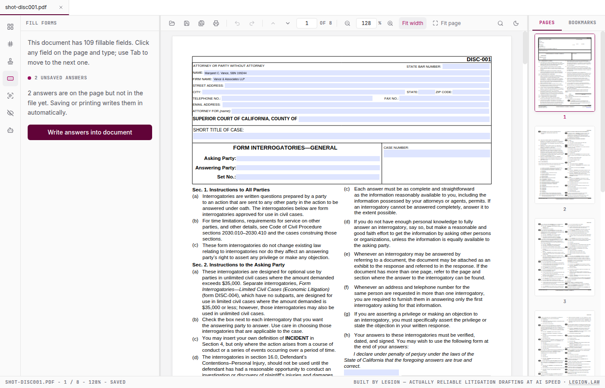
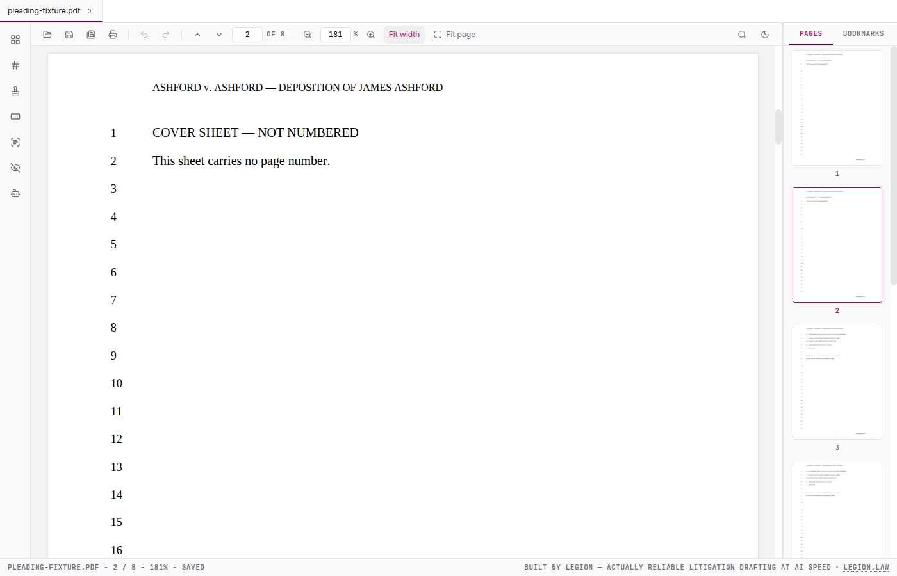

# Legion PDF

**A fast, free, open-source desktop PDF editor built for litigation attorneys.**
The anti-Acrobat: opens instantly, scrolls a 2,000-page transcript smoothly,
handles the encrypted Judicial Council forms Acrobat holds hostage, and does
everything on your machine — no cloud, no subscription, no popups.

Built by [Legion](https://legion.law), tested daily in a working litigation
practice.



## Download

Grab the Windows installer from the
[latest release](https://github.com/CasusBelli1337/legion-pdf/releases/latest).
No account, no telemetry, fully offline (the optional AI panel is the only
feature that talks to the internet, and only when you use it).

## What it does

- **View** — instant open, smooth scrolling through huge records, tabs,
  thumbnails, bookmarks, search, print
- **Court forms** — opens the encrypted fillable forms courts publish
  (California Judicial Council forms included), renders every field, and
  writes your answers into the file so they show up in any PDF viewer
- **Assemble** — combine and split PDFs, reorder / rotate / delete / extract
  pages, insert pages from another file
- **Stamp** — Bates numbering across a production set, exhibit stamps,
  watermarks, page numbers, signatures with date
- **Copy that understands pleadings** — select text on pleading paper and the
  copy leaves out line numbers, running heads, footers, and Bates stamps, and
  can append a `(page:line)` citation automatically
- **OCR** — bundled Tesseract runs on every core of your machine, fully
  offline; scanned filings become searchable without leaving your desk
- **Redact** — true redaction: the content is destroyed and rebuilt, never
  just covered with a rectangle, and a verification pass proves the redacted
  text is gone from the file
- **Produce** — metadata scrubbing and annotation flattening before anything
  leaves the office
- **Centurion** — an optional built-in Claude panel for asking questions about
  the open document (bring your own Anthropic API key; stored encrypted by
  your OS, never written to a file)



## Why we open-sourced it

[Legion](https://legion.law) builds AI-native litigation software — drafting,
document intelligence, and case workflow for real law practices. Legion PDF is
the desktop workhorse that grew out of that work: attorneys shouldn't need a
$240/year subscription to Bates-stamp a production or fill out a court form.
So this one is free, and the code is open under AGPL-3.0. If the bigger
platform interests you, that's at [legion.law](https://legion.law).

## Building from source

```bash
npm install
npm run dev          # electron-vite dev mode (hot reload)
npm test             # Vitest — 1,600+ tests over the pure PDF engine
npm run typecheck    # tsc --noEmit across all tsconfigs
npm run lint
npm run build:win    # package the Windows NSIS installer into release/
```

Building the Windows installer on Linux/WSL needs 32-bit wine (the NSIS
stub is 32-bit). Easiest is electron-builder's own image:

```bash
docker run --rm -v "$PWD":/project -w /project -e HOME=/tmp \
  electronuserland/builder:wine \
  npx electron-builder --win nsis --config.win.signExecutable=false
```

## Under the hood

Electron + React 19 + TypeScript (strict, no `any`) + Tailwind 4. Rendering
by [PDF.js](https://mozilla.github.io/pdf.js/), writing by
[pdf-lib](https://pdf-lib.js.org/), encrypted-form unlocking by
[qpdf](https://qpdf.sourceforge.io/) compiled to WebAssembly, OCR by bundled
[Tesseract](https://github.com/tesseract-ocr/tesseract).

The architecture keeps a hard wall between three zones: a pure PDF engine
(`core/`, plain functions over bytes, fully unit-tested), the Electron main
process (`electron/`, file IO and IPC), and the React renderer (`src/`).
Every PDF operation verifies its own output — page counts in vs. out,
re-parse of saved bytes — because in litigation, silent data loss is the one
unforgivable failure. See `docs/ARCHITECTURE.md`.

Example documents in the test suite use fictional parties and matters.

## License

[AGPL-3.0](LICENSE). You can use, study, modify, and share it freely; if you
distribute a modified version or run one as a service, your changes must be
open too.
